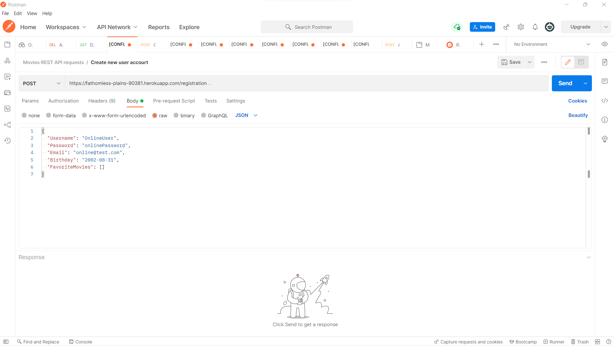

# movie_api

## Objective

**To build the server-side component of a “movies” web application.  The web application will provide users with access to information about different movies, directors, and genres. Users will be able to sign up, update their personal information, and create a list of their favorite movies.**

## Context

It’s no longer enough for a JavaScript developer to be skilled in frontend development alone. It’s become essential that you be able to interface with (as you did in Achievement 1) and even create your own APIs. For this reason, throughout this Achievement, you’ll create a REST API for an application called “myFlix” that interacts with a database that stores data about different movies. 

In the next Achievement, you’ll build the client-side component of this same application using REACT. By the end of Achievement 3, you’ll have a complete web application (client-side and server-side) built using full-stack JavaScript technologies that you can showcase in your portfolio. The project will demonstrate your mastery of full-stack JavaScript development, including APIs, web server frameworks, databases, business logic, authentication, data security, and more. The complete tech stack you’ll master is known as the MERN (MongoDB, Express, React, and Node.js) stack. 

Note that it’s not a requirement that you name your application “myFlix.” You’re also free to decide which movies you wish to include in your project. For example, you may want to build a movie application specifically for period or superhero movies, or a more diverse application with a wider user base. It’s up to you! 

---

## Design Criteria

### User Stories

- As a user, I want to be able to receive information on movies, directors, and genres so that I can learn more about movies I’ve watched or am interested in.
- As a user, I want to be able to create a profile so I can save data about my favorite movies.

### Feature Requirements

_The feature requirements below were extracted from the user stories listed above. Your project will only be approved if the following “essential” feature requirements are implemented in your Achievement project._
 

#### Essential Features

- Return a list of ALL movies to the user
- Return data (description, genre, director, image URL, whether it’s featured or not) about a single movie by title to the user
- Return data about a genre (description) by name/title (e.g., “Thriller”)
- Return data about a director (bio, birth year, death year) by name
- Allow new users to register
- Allow users to update their user info (username, password, email, date of birth)
- Allow users to add a movie to their list of favorites
- Allow users to remove a movie from their list of favorites
- Allow existing users to deregister

#### Optional Features

_These are optional features. You can incorporate these into your project through Bonus Tasks as you work through the Achievement. If you don’t have time, you can use this list as inspiration for a second iteration of your application once you’ve completed the course._

- Allow users to see which actors star in which movies
- Allow users to view information about different actors
- Allow users to view more information about different movies, such as the release date and the movie rating
- Allow users to create a “To Watch” list in addition to their “Favorite Movies” list

---

## Technical Requirements

- The API must be a Node.js and Express application.
- The API must use REST architecture, with URL endpoints corresponding to the data operations listed above
- The API must use at least three middleware modules, such as the body-parser package for reading data from requests and morgan for logging.
- The API must use a “package.json” file.
- The database must be built using MongoDB.
- The business logic must be modeled with Mongoose.
- The API must provide movie information in JSON format.
- The JavaScript code must be error-free.
- The API must be tested in Postman.
- The API must include user authentication and authorization code.
- The API must include data validation logic.
- The API must meet data security regulations.
- The API source code must be deployed to a publicly accessible platform like GitHub.
- The API must be deployed to Heroku.

---

## Setting Up the Development Environment and necessary Installations:

1.  install the atom-ide-ui package, followed by the Atom IDE-TypeScript package: 
    To do so, run `apm install atom-ide-ui` and 
    `pm install ide-typescript` in the Terminal

2.  Installing Node:

    ##### MacOS Users:

    1. Look for Xcode on the App Store and download it
    2. open the terminal and run `xcode-select --install` to install additional command line tools for Xcode needed for installing nvm (Node Version Manager) and eventually NodeJS.
    3. Once the installation is done, check what shell is being used by your terminal. 
       - If it says “bash”: `run touch ~/.bash_profile`
       - If it says “zsh”: run `touch ~/.zshrc`
    4. Visit nvm’s GitHub repository page and scroll down to the “Installing and Updating” section. Execute one of the commands (one uses curl, while the other uses wget) in the terminal.
    5. Close the terminal, then open a new one. 
       Test whether nvm has successfully been installed by running command -v nvm. You should get nvm logged in a new line. 
       Run `nvm install lts/* or nvm install --lts` This will install the latest LTS version of Node.  
       _If neither command works, run nvm ls-remote to display a list of available Node versions as shown in the image below, then install the latest version that has “LTS” next to it. For example, in the image below, you can see “v12.16.3 (Latest LTS: Erbium).” To install it, run nvm install 12.16.3. (Note: This is just an example! LTS might have a different version number by the time you’re reading this. Make sure you install whatever you see is the latest)._
    6. Run `nvm alias default lts/*` or `nvm alias default [version number you installed]` if lts/\* didn't work (e.g., nvm alias default 12.16.3). This will set the default Node to be the one you’ve just installed.
    7. Close the current terminal one more time and open a new one. Then, test whether Node is installed by running `node -v` to see the version of the currently installed Node.
    8. If you ever want to upgrade/downgrade your version of Node, redo the last three steps. Whatever version you install, make sure to run nvm alias default [the installed version] to set it as your default version of Node.

    ##### Windows Users:

    1. Make sure that your Windows 10 is up to date.
    2. Download the nvm-windows installer. Alternatively, you can also look for newer releases, just make sure to download the “nvm-windows.zip” file of the newest release.
    3. Install nvm-windows (leave everything as it is while going through the setup screens).
    4. Close all PowerShell windows and open a new one, then run `nvm list available`. You should see a table of the newest node versions.
    5. Install the newest version under the “LTS” column (which stands for Long Term Support) that appears in your PowerShell. **For example**: the version to install is 14.15.1. To install it, run the command: `nvm install 14.15.1`
    6. Run the command: `nvm use <installed version>`. If the version you just installed was “14.15.1,” for example, you’d run the command: `nvm use 14.15.1`. If Windows asks you for permission, then allow it.

3.  `npm` is the default Node package manager for Node.js 
    it was installed automatically with your installation of Node. npm consists of three distinct components: the npm website, the npm CLI, and the npm JavaScript Package Registry (a large, public database of JavaScript packages). 
    To check your current version, simply type the following command into your terminal: `npm -v`

4.  Creating a Default “package.json” File: 
    Running `npm init --yes` or `npm init -y`in your terminal will generate a new “package.json” file with information about the current directory.

5.  To install Express, run the following command in the terminal: `npm install --save express`

6.  To install body-parser, run the following command in the terminal: `npm install --save body-parser`

7.  Add “node_modules” folder to a “.gitignore” file.

8.  Logging with Morgan; logging middleware for Express is called Morgan. As with most things Node.js, it can be found in the npm package registry.
    install it as follows:`npm install morgan --save`

9.  In order to build a full-fledged REST API, you’ll need to utilize these types of requests and being a few new pieces of Express/Node.js functionality:

    - In BASH, run the code `npm init -y`
    - run the code npm install --save express uuid body-parser (this installs Express, Body-parser, and Uuid)

10. Testing Your API with Postman:  
    Go ahead and start by downloading Postman.

11. Documenting Your API:  
    Write a documentation.html file, include For every endpoint in your API: 

    - A high-level description of what kind of data the endpoint returns
    - The endpoint URL
    - The method type (GET, POST, PUT, or DELETE)
    - The query parameters (parameters in the URL)
    - The format of data expected in the body of the request (and an example)
    - The format of the response data
    - An example request
    - An example response

12. Installing PostgreSQL: 
    first download the correct version the PostgreSQL from the PostgreSQL download page. Once the download is complete, you’ll need to run through the Installation Wizard. 
    Go ahead and keep all of them selected except for the “Stack Builder” component!

13. Installing MongoDB: 

    - In order to install MongoDB, you’ll need to install HomeBrew
      - https://brew.sh/
      - make sure that your macOS's version is at least High Sierra (10.13), as this is a minimum requirement for installing HomeBrew
    - Once Homebrew has finished installing or updating, type `brew tap mongodb/brew` into your terminal to install the MongoDB custom "tap."
    - With the tap installed, you can install the latest version of MongoDB via the command `brew install mongodb-community`
    - Finally, type `brew services start mongodb-community` into your terminal. This is what actually starts up the Mongo server. 
      _You’ll need to have the Mongo server running any time you want to interact with your database, view your myFlix app, or use the Mongo shell._
    - To stop running the Mongo server, enter the command `brew services stop mongodb-community` in your terminal.

14. Configuring Schema and Models with Mongoose: 
    Mongoose is installed as a local project dependency, in order for Mongoose to work execute: `npm install mongoose` 
    _IMPORTANT! _
    _Double-check your code and make sure that body-parser is being imported _
    _To install the body-parser package, run: `npm install --save body-parser`_

15. Authentication in Node/Express Using Passport: 
    you need to install Passport itself, followed by the libraries for the authentication methods to use, HTTP authentication and JWT authentication packages locally.  
    simply run a single command to install all four packages: `npm install --save passport passport-local passport-jwt jsonwebtoken`

16. As this app was built using the MERN stack, it´s needed to implement CORS by way of Express (the “E” in “MERN”). To do so, run the following command in your terminal: `npm install cors`

17. Hashing: 
    In Node.js, you can use a module called bcrypt to hash users’ passwords and compare hashed passwords every time users log in in order to ensure a more secure login authentication process. To install bcrypt, run this command in your terminal: `npm install bcrypt`

18. Server-Side Validation:  
    There are a number of JavaScript libraries you can use when it comes to adding validation to a Node.js/Express application, but for the purpose of this Exercise, you’re going to be looking into a specific one called “express validator.” The express validator library offers a variety of validation methods for different types of inputted data. 
    To install this library go ahead and type the following into your terminal: `npm install express-validator`

19. Finally, Hosting the API   
    Hosting with Heroku:

    - Install the Heroku Toolbelt as explained in the Heroku tutorial (https://devcenter.heroku.com/articles/getting-started-with-nodejs#set-up). 
      **IMPORTANT!!**  
      Only complete the steps listed on the “Set-Up” page (the initial installation and the herku login command in your terminal).
    - Update your “package.json” file to include “start” script. 
      open “package.json” file in text editor and under the scripts section, add the following code: `"start": "node index.js"`
    - Save all the changes you’ve made to your files and commit/push the changes to your GitHub repository using GitHub Desktop.
    - Then, open the terminal and navigate to your project folder. Once inside it, create an app on Heroku by running the command `heroku create` from your project directory. 
      _This creates a new empty project on Heroku with a randomly assigned name and URL such as “http://warm-wave-1943.herokuapp.com.”_
    - Send your application to Heroku using Git in the terminal. You’ll do so using a Git command called `git push`. The command you’ll want to enter is `git push heroku main`.  
      This command tells Heroku to grab a copy of your committed code and use it to deploy your site on Heroku.

20. Once you push to Heroku, the URL to your site will be generated instantly—it will be displayed in your terminal, or you can copy it from the Heroku dashboard. From here, you can change a wide variety of settings for your app, for instance, the name of your website.  
    Click on the “Settings” tab to change your website URL. Before the change will take place, however, you need to update your Git remote, so next, in your terminal, run the following commands: 
    `git remote rm heroku`  
    `heroku git:remote -a new_address`

21. Uploading Your Database to MongoDB Atlas:  

    - sign up for a MongoDB Atlas account (https://account.mongodb.com/account/register)
    - Once you’ve registered a new account and accepted the terms of service
    - Whatch the tutorial which will walk you through setting up your first MongoDB Atlas cluster
    - Select the free plan by clicking on the Create a cluster button
    - Select one of the available cloud providers (AWS is always a goog choice)
    - Once you’ve selected a Cloud Provider, you’ll be shown a list of the available regions. Each region is the location of a server. Pick a region that’s in the same country as (or the one that’s closest to) the location of your Heroku app server.
    - Make sure that M0 Cluster is selected (the one that has “Free forever” in its “Base Price” column) in the Cluster Tier panel
    - Afterwards, you’ll be redirected to the dashboard. (You’ll see blue-highlighted notice indicating that your cluster is being deployed, This might take a few minutes. Wait for it to be deployed (when the blue-highlighted notice at the top goes away))
    - Now that the cluster has been deployed, you need to create a database user for your database that will be added later on. Click on Database Access under the SECURITY section located in the left side bar, then click on the green Add New Database User button
    - A popup form will appear prompting you to fill in the details for your new database user. Fill out the username and password fields, making sure to save them somewhere as you’ll need them in the upcoming steps
    - Hit the Add User button and wait for the changes to be deployed
    - Open the Clusters page (by clicking on Databases under the DEPLOYMENT section in the sidebar), then click on the . . . button shown in the image below. From the dropdown menu that appears, select Command Line Tools
    - The next screen contains the necessary instructions for importing the data into your cluster's database. What you’re looking for is the command that starts with mongoimport under the Data Import and Export Tools section
    - Copy the command, paste it somewhere in your code editor or in a text editor to modify:   - <PASSWORD>: the password of the newly created user - <DATABASE>: the name of the new database you’ll create; set it to myFlixDB (the specified database will automatically be created if it’s not on Atlas already) - <COLLECTION>: the name of the new collection to be created on Atlas; make sure to use the same collection names you used locally (open a new terminal and run db.getCollectionNames() if you forgot the names) - <FILETYPE>: set it to json - <FILENAME>: the path of the exported file on your machine 
      _Once you’ve replaced these elements, you can run the finalized command in the terminal to import the data into the new database on the remote cluster_

22. Connecting Database to our API on Heroku: 
    Follow the steps explained on Heroku page.

---

## Postman Test:

A screenshot of a postman test to proove the functionality of the API and database:

